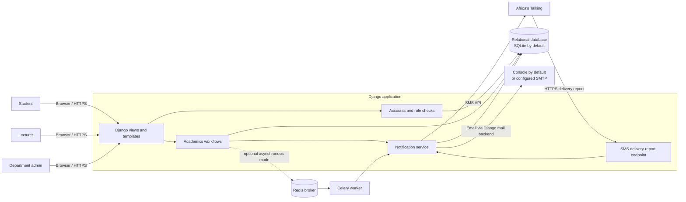
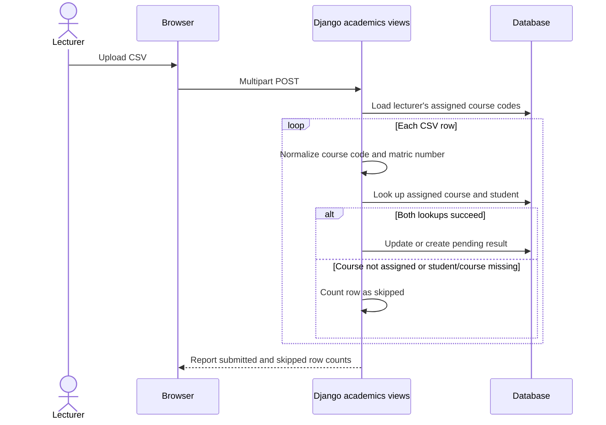
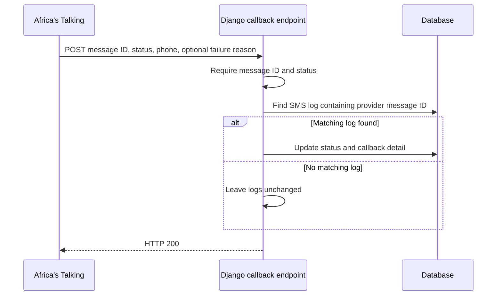

# AFUSTA CS Result Alert System

This document describes the architecture and workflows implemented in the
repository, followed by a proposed roadmap. The diagrams reflect the current
Django application; roadmap items are recommendations, not features already
present.

For the diagrams without the detailed notes, see
[the visual overview](system-diagrams.md).

## High-level architecture



### Components and responsibilities

| Component | Responsibility | Current implementation |
|---|---|---|
| Web UI | Role-specific dashboards, forms, result upload/review, and notification history | Django views and server-rendered templates; no separate frontend/API service |
| Accounts | Authentication, profiles, and authorization by role | Custom Django `User` with `student`, `lecturer`, and `admin` roles; student and lecturer profile records |
| Academics | Courses, lecturer-course assignments, results, and approval lifecycle | Django ORM models; lecturer uploads are constrained to assigned courses in the form; student views filter to approved results |
| Notification service | Compose and send an alert, recording a per-channel outcome | `notifications/services.py`; email through Django's configured backend, SMS through Africa's Talking or a simulated log entry |
| Background processing | Move notification sending out of the approval request when enabled | Celery task with Redis broker; synchronous delivery is the default |
| Delivery report | Update the SMS log after a provider callback | CSRF-exempt POST endpoint; matches an SMS log using the provider message ID currently stored in its detail text |
| Persistence | Store users, profiles, courses, assignments, results, and notification logs | SQLite by default; Django migrations define the schema |

### Core data relationships

- A `User` has one role; student and lecturer users have their respective
  one-to-one profile records.
- A lecturer can be assigned to multiple courses through `LecturerCourse`.
- A `Result` joins a student and course and carries score, term/session,
  uploader, approval state, and approval metadata. A uniqueness constraint
  prevents duplicate student/course/semester/session records.
- A `NotificationLog` belongs to a result and records the outcome separately
  for each channel (email or SMS).
- Deleting a student or course cascades to associated results and their
  notification logs. Deleting a lecturer removes assignments while uploaded
  results remain, with the uploader reference set to null.

## Sequence flows

### Result submission, approval, and alert

```mermaid
sequenceDiagram
    actor Lecturer
    participant Browser
    participant Django as Django academics views
    participant DB as Database
    actor Admin
    participant Notify as Notification service
    participant Mail as Email backend
    participant SMS as Africa's Talking
    participant Worker as Celery worker

    Lecturer->>Browser: Submit result or CSV
    Browser->>Django: POST upload
    Django->>Django: Check lecturer role and assigned course
    Django->>DB: Save result as pending
    Django-->>Browser: Show submission confirmation

    Admin->>Browser: Review pending result
    Browser->>Django: POST approve
    Django->>DB: Mark approved; record approver and time
    alt Synchronous mode (default)
        Django->>Notify: Send approved-result alert
    else Asynchronous mode
        Django->>Worker: Enqueue result ID
        Worker->>DB: Load result, student, and course
        Worker->>Notify: Send approved-result alert
    end
    Notify->>Mail: Send email
    Notify->>DB: Record email outcome
    alt SMS credentials are configured
        Notify->>SMS: Submit SMS
        SMS-->>Notify: Submission response and provider message ID
        Notify->>DB: Record SMS submission outcome
    else SMS credentials are absent
        Notify->>DB: Record simulated SMS and message text
    end
    Notify-->>Django: Delivery attempt completed
    Django-->>Browser: Show approval confirmation
```

The student dashboard reads only approved results. The SMS provider's initial
response indicates submission status; a later delivery report may update the
SMS log with its final delivery status.

### Bulk CSV upload



CSV columns are `matric_no,course_code,score,semester,session`. The current
implementation skips rows with an unassigned course or missing student/course;
it does not provide a detailed per-row error report.

### SMS delivery report



## Proposed roadmap

Order is intentional: secure and protect result integrity before enabling a
real institutional deployment, then make delivery and operations dependable.

### Phase 1 — Pilot safety and result integrity

- Move deployment-sensitive settings out of source defaults and configure
  environment-specific secret, debug, allowed-host, HTTPS, and cookie policy.
- Make approval and rejection POST-only; make approval a guarded state
  transition from `pending` so repeat requests cannot resend alerts.
- Validate score range and each CSV row server-side; limit upload size and
  report row-level validation failures. Define whether a batch is all-or-
  nothing or may partially succeed, then implement that behavior explicitly.
- Add tests for role boundaries, invalid and repeated approvals, result
  visibility, malformed CSV, and notification side effects.
- Protect the delivery-report endpoint against forged or replayed callbacks
  using the provider-supported verification mechanism (or a suitably
  constrained alternative), and test unknown/repeated provider message IDs.

**Exit criteria:** deployment configuration has no development-only
credentials or debug behavior; only an authorized admin can perform a
single valid approval; malformed imports cannot silently produce invalid
results; callback updates are verified and traceable.

### Phase 2 — Reliable notification delivery

- Use a durable delivery/outbox record created with the approval transition,
  and dispatch work only after the database transaction commits.
- Add bounded Celery retries with backoff for transient provider failures.
  Make retries idempotent so they do not create duplicate email/SMS messages.
- Store provider message IDs and delivery state in dedicated fields rather
  than parsing IDs out of a free-text log detail.
- Distinguish queued, provider-accepted, delivered, and failed states, and
  expose retryable failures to an administrator.
- Add integration tests using mocked mail, SMS, broker, and callback responses.

**Exit criteria:** transient failures recover without duplicate alerts;
every channel attempt has a durable status and can be reconciled with provider
delivery reports.

### Phase 3 — Production operations and institutional rollout

- Move production persistence from local SQLite to a managed relational
  database such as PostgreSQL; document and rehearse migrations and backups.
- Establish staging and production configuration, HTTPS deployment, static
  asset handling, database backup/restore checks, and a rollback procedure.
- Add structured application logs and operational monitoring for approval
  volume, queue age, notification failure rate, callback errors, and worker
  health; alert an operator on sustained failures.
- Define student onboarding and data ownership with the department. If
  self-registration is not acceptable, add roster-based enrollment and an
  account verification/activation workflow.
- Document support procedures for rejected uploads, corrected results,
  bounced email, undelivered SMS, account recovery, and retention/deletion.

**Exit criteria:** an operator can deploy and restore the service, identify
stuck or failed alerts, and support the department's agreed onboarding and
data-retention process.

## Scope notes

- The roadmap assumes the existing Django application remains the product
  baseline; it does not propose a frontend rewrite or microservice split.
- Whether result correction should replace an existing result, require a new
  approval, and preserve an audit history is a department policy decision
  that should be settled before rollout.
- Expected student population, peak CSV size, alert delivery service levels,
  and record-retention requirements are not specified in the repository;
  use those to size infrastructure and finalize later roadmap priorities.

## Source map

- Project and operating notes: [`README.md`](../README.md)
- Main routing and application configuration: `resultalert/urls.py`,
  `resultalert/settings.py`, and `resultalert/celery.py`
- Accounts and role checks: `accounts/models.py`, `accounts/views.py`,
  `accounts/decorators.py`
- Courses and result lifecycle: `academics/models.py`, `academics/forms.py`,
  `academics/views.py`
- Notification delivery, task, and callback: `notifications/services.py`,
  `notifications/tasks.py`, `notifications/views.py`
