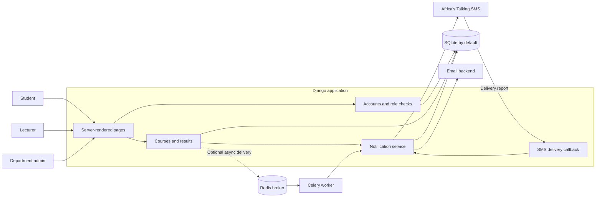
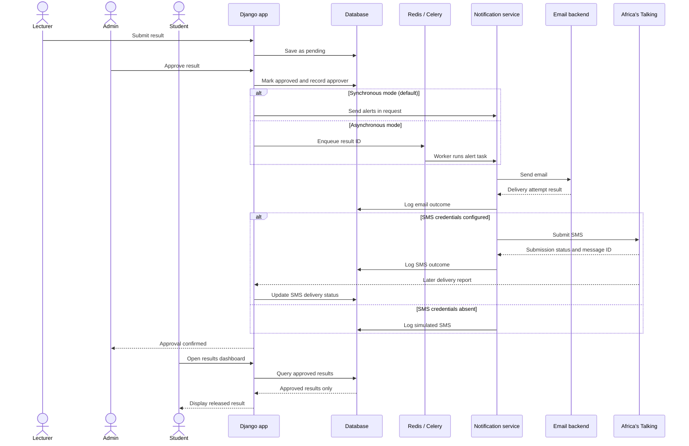
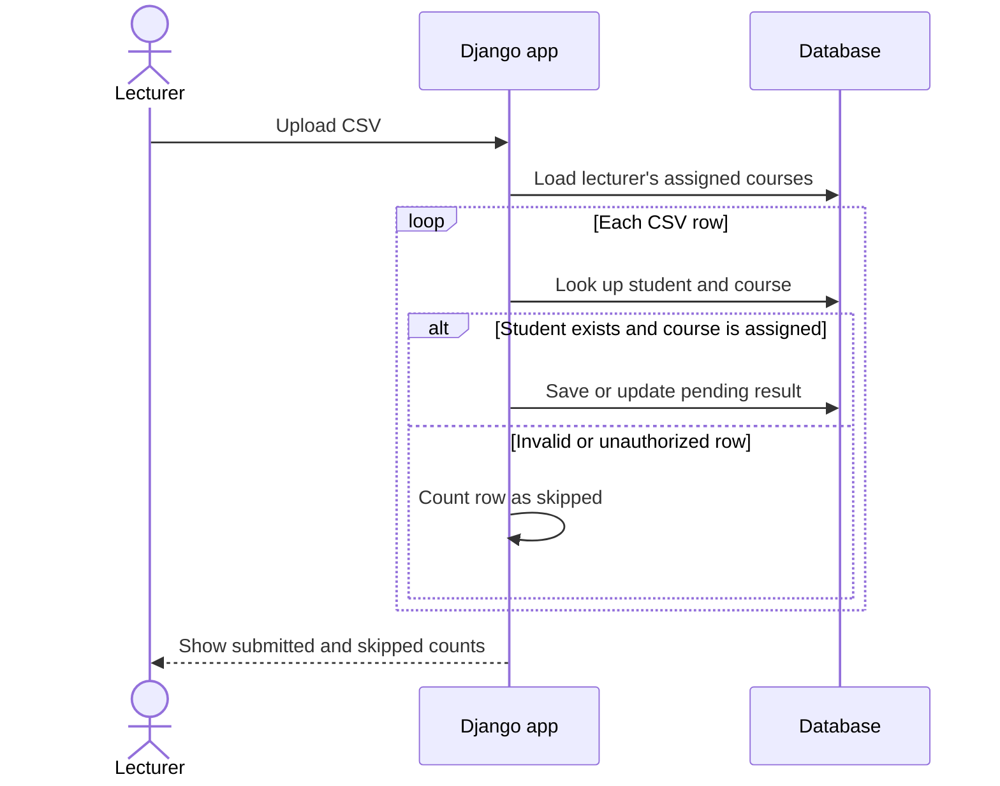
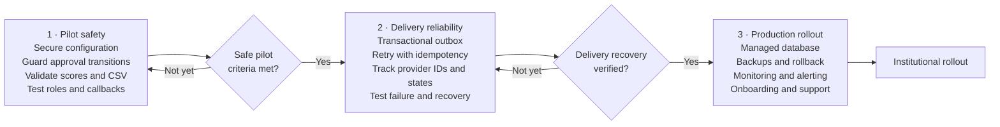

# AFUSTA Result Alert System — Visual Overview

Open this file in a Markdown preview that renders Mermaid diagrams.

## High-level architecture

## Result approval and notification sequence

## CSV result-upload sequence

## Proposed roadmap

Roadmap boxes are recommendations, not implemented features. Agree the
department's result-correction, onboarding, and retention policies before
production rollout. See [the detailed notes](architecture-and-roadmap.md)
for current behavior and phase exit criteria.
